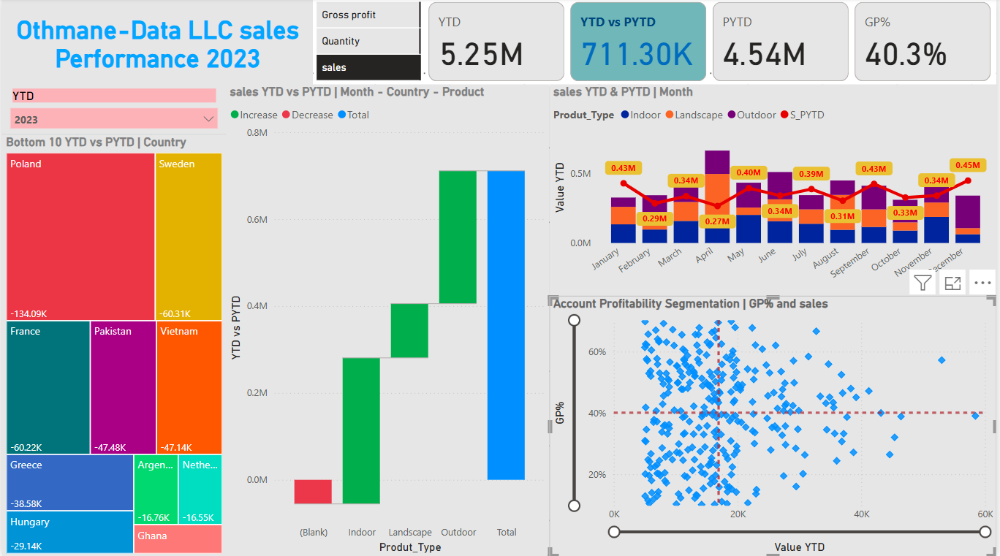
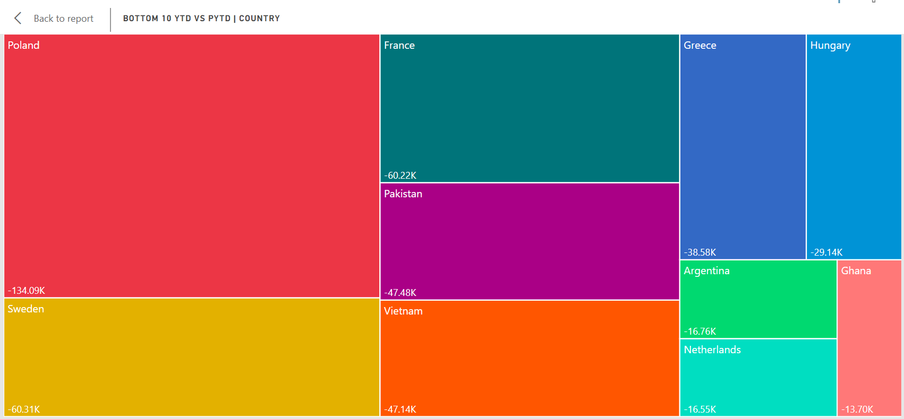
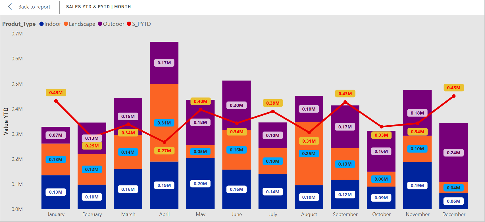
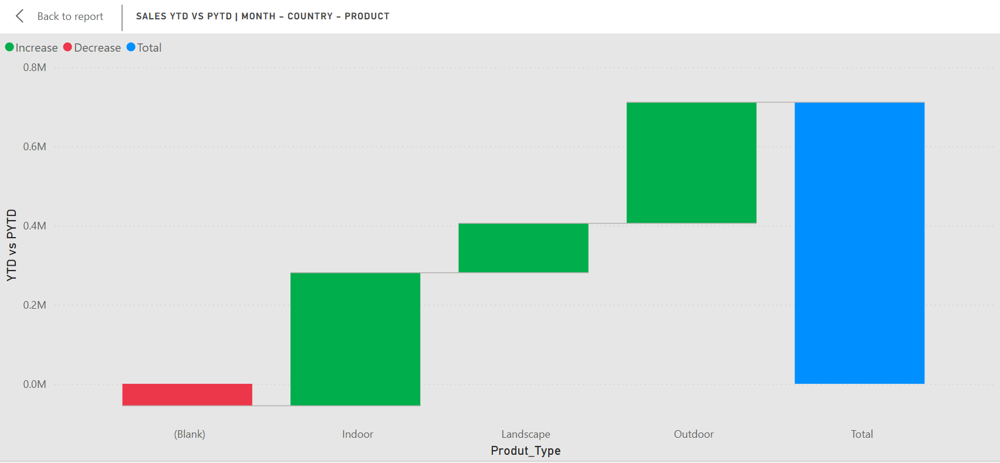
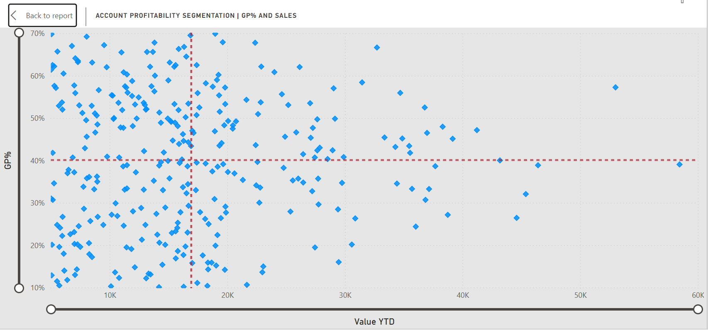

# PLANT_Company_Dashboard_by_POWER_BI




---
## Introduction

The "Othmane-Data LLC Sales Performance Dashboard 2023" provides an in-depth analysis of the company's sales, gross profit, and other key performance indicators (KPIs). The dashboard uses various visualizations to track progress year-to-date (YTD) versus the prior year-to-date (PYTD), identify areas of growth and decline, and assess profitability by country, product type, and account segmentation.

## Dashboard File

My final [dashboard](all_dash_llc.pdf)

## Problem statement

1. Highlight the countries with the lowest sales performance, identifying significant declines compared to the previous year.
2. Understand which product categories are driving overall sales performance.
3. Track monthly sales performance and compare trends between YTD and PYTD for all product types.
4. Evaluate the relationship between gross profit percentage (GP%) and sales volume for different accounts.
5. Provide a quick summary of overall sales performance metrics.


## Skills/ concepts demonstrated

- 🧮 Data Cleaning and Dax
- 📉 Charts and Visualization
- ❎ Conclusion and Recommendations

### 🧮 Data Cleaning and Dax :

- Total Employees ;
```sql
Total Employees = COUNT(HR_Analytics[EmpID])

```

### 📉 Charts and Visualization :

KPI's Requirements   
1.	Sales YTD: $5.25M  
* Tracks total sales revenue for the current year to date.  
2.	Sales PYTD: $4.54M  
* Compares total sales revenue from the same period in the previous year.  
3.	YTD vs PYTD Growth: +711.30K (+15.66%)  
* Measures the growth in sales revenue between the current YTD and PYTD.  
4.	Gross Profit Percentage (GP%): 40.3%  
* Represents the profitability percentage, calculated as gross profit divided by total sales revenue.


The report comprises 4 charts:

___1. Sales Performance by Country (Bottom 10);___


___2. Sales by Product Type;___


___3. Monthly Sales Trends;___


___4. Account Profitability Segmentation.___


 the all dashboard 

___KPI's Requirements___


__Objective:__ Provide a quick summary of overall sales performance metrics.  
__Problem Statement:__ The company achieved a 5.25M YTD sales with a GP% of 40.3%, reflecting positive growth compared to PYTD (4.54M). Further optimization is needed to maintain momentum.  
___KPI Requirements:___

* Total sales YTD and PYTD.
* GP% and its trend.
* Variance analysis of sales growth.

  
___1. Sales Performance by Country (Bottom 10);___



__Objective:__ Highlight the countries with the lowest sales performance, identifying significant declines compared to the previous year.  
__Problem Statement:__ Sales in Poland, Sweden, and France have shown significant negative trends, with Poland experiencing the largest drop (-134.09K). These trends could reflect market challenges or ineffective strategies.  

___KPI Requirements:___

* Total sales YTD vs PYTD per country.
* Percentage change in sales performance.
* Highlight regions with the most significant declines.

  
___2. Sales by Product Type;___




__Objective:__ Understand which product categories are driving overall sales performance.  
__Problem Statement:__ Product categories such as "Outdoor" and "Indoor" are performing well, whereas others are lagging, requiring a deeper understanding of demand and profitability by product.  

___KPI Requirements:___

* Sales distribution by product type.
* Contribution of each category to total sales YTD.

  
___3. Monthly Sales Trends;___




__Objective:__ Track monthly sales performance and compare trends between YTD and PYTD for all product types.  
__Problem Statement:__ While sales have generally improved YTD, the trends are inconsistent across months, suggesting possible seasonality or market fluctuations.  

___KPI Requirements:___

* Monthly sales YTD and PYTD.
* Growth trends for each product type.

  

___4. Account Profitability Segmentation.___



__Objective:__ Evaluate the relationship between gross profit percentage (GP%) and sales volume for different accounts.  
__Problem Statement:__ Certain accounts contribute high sales volumes but have low GP%, which could negatively impact profitability.  

___KPI Requirements:___

* Scatter plot of GP% versus sales.
* Identification of high-sales, low-profit accounts.

  

### ❎ Conclusion and Recommendations:

#### Conclusion

This dashboard provides a detailed analysis of key HR metrics, offering valuable insights into employee demographics, satisfaction, attrition, and workforce distribution. The data reveals notable trends, such as a male-dominated workforce (60%), a high concentration of employees in the Research & Development department (64.93%), and significant attrition (230 employees). While job satisfaction is relatively higher in the Life Sciences field, it varies widely across educational backgrounds. The dashboard also highlights business travel trends, with the majority of employees traveling rarely.

#### Recommendations

__Enhance Gender Diversity__

* Develop and implement gender-inclusive hiring and promotion policies.
* Introduce mentoring programs to support female employees in underrepresented roles.  

__Reduce Employee Attrition__

* Conduct exit interviews to identify common reasons for turnover.
* Offer career development opportunities, competitive benefits, and a supportive work environment to improve retention.  

__Optimize Job Satisfaction__

* Address the disparities in job satisfaction among employees from different education fields.
* Regularly conduct employee satisfaction surveys to monitor and act on feedback.  

__Improve Workforce Balance__

* Reassess resource distribution in departments with lower employee representation (e.g., Sales and Human Resources).
* Provide targeted training programs to upskill employees in smaller departments.  

__Optimize Business Travel Expenses__

* Review travel policies to ensure cost-effectiveness while meeting business needs.
* Consider leveraging virtual meetings for employees traveling frequently.  

__Leverage Data-Driven Decision-Making__

* Use predictive analytics to identify future HR trends and challenges, such as attrition risk or workforce aging.
* Continuously monitor KPIs on the dashboard to adapt strategies as needed.  
